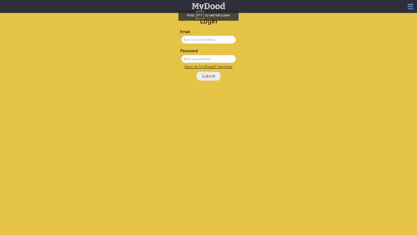

# MyDoods

## User Story

```
AS a user I wish to share drawings
WHEN I sign up on MyDoods
THEN I have an account to login with
WHEN I login everyday
THEN I get to draw the word of the day
WHEN I complete my drawing
THEN I post my drawing
WHEN I visit my timeline
THEN I see the drawings that my friends made that day
WHEN I login the next day
THEN I see an updated word of the day to draw
WHEN I visit my profile
THEN I see all my drawings
```

## Description of our App

We wanted to make a social media app for users that like to draw. So we made MyDoods!
On MyDoods, you get a new word everyday that you have to draw. MyDoods allows users to practice their drawing skills and have the ability to share it with their friends! As well as seeing their friends' drawings!

## Languages used

This App was made using ReactJs, CSS, JSX, And Javascript.

### Packages used:

- react
- jwt
- axios
- bcrypt
- dotenv
- express
- mongoose
- multer
- apollo
- and many more!

## Meet the developers

This app was developed by the following users. Please check out some of their other work below via their Github links!

- Andy Bjerk - Click [HERE](https://github.com/savoryboi)
- Palmer Sola- Click [HERE](https://github.com/palmersola)
- Derek Bass - Click [HERE](https://github.com/Derjbass)
- Mustafa Aboghalyoun - Click [HERE](https://github.com/KappaMustafa)

## Demo of App



## Deployed link to App

- Click [HERE]() to use our App!

## Link to Repository storing application

- Click [HERE](https://github.com/savoryboi/my-dood) for the repository
